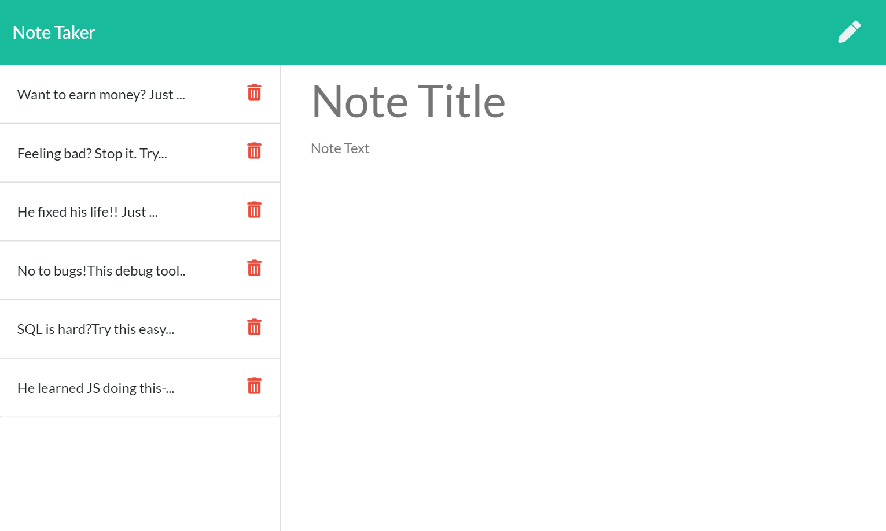

# Note Taker

**You can access the finished project here:
<https://amazing-note-taker55.herokuapp.com/>**

---

# Unit 11 Express Homework: Note Taker

### The task

Create an application that can be used to write, save, and delete notes.

* App should be deployed on [Heroku](https://heroku.com/)
* Allows creating and saving notes
* Allows viewing previously stored notes
* Allows to delete previously stored notes
* Uses an express backend
* Connects to an existing frontend
* Retrieves note data from a JSON file

## Requirements
* Following HTML routes are created:
  * GET `/notes` - Returns the `notes.html` file.
  * GET `*` - Returns the `index.html` file
* Following API routes are created:
  * GET `/api/notes` - Reads the `db.json` file and return all saved notes as JSON
  * POST `/api/notes` - Receives a new note to save, adds it to the `db.json` file, and then returns the new note to the client
  * DELETE `/api/notes/:id` - Receives a query parameter containing the id of a note to delete. Reads all notes from the `db.json` file, removes the note with the given `id` property, and then rewrites the notes to the `db.json` file
* Has a `db.json` file used to store and retrieve note data (utilizes the `fs` module)
* Each note has a unique `id`

